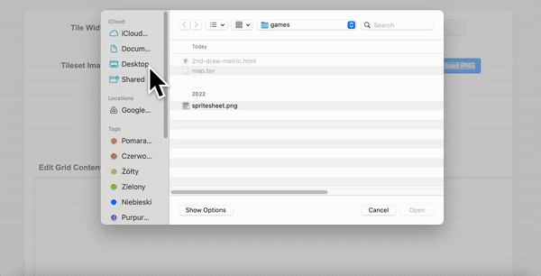

# Isometric Tileset Tester
 A single-file, browser-based tool to rapidly assess isometric tilesets and allow simple editing.

 

__Motivation:__ I just wanted to check if a bunch of tilesets will tile smoothly and quickly experiment with how to cut them. It's a simple task, why should I install a 100MB+ tool to do it?

Just open it in your browser. Tested only in Chrome.

Example tileset included by: [scrabbling](https://scrabling.itch.io/pixel-isometric-tiles).