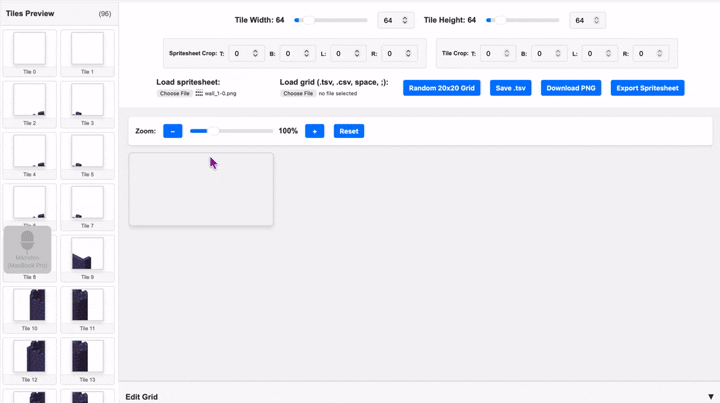

# Isometric Tileset Tester
 A single-file, browser-based tool to rapidly assess isometric tilesets and allow simple editing.

 

You can:
- Dynamically cut custom-sized tiles
- Crop the spritesheet
- Crop individual tiles
- Generate and modify random test grid
- Load and save the test grid
- Download the test map PNG
- Export the edited spritesheet

__Motivation:__ I just wanted to check if a bunch of tilesets would tile smoothly and quickly experiment with how to cut them. It's a simple task, why should you install a 100MB+ tool to do it?

Just open it in your browser. Tested in Chrome and Safari.

Example tileset included by: [scrabbling](https://scrabling.itch.io/pixel-isometric-tiles).
